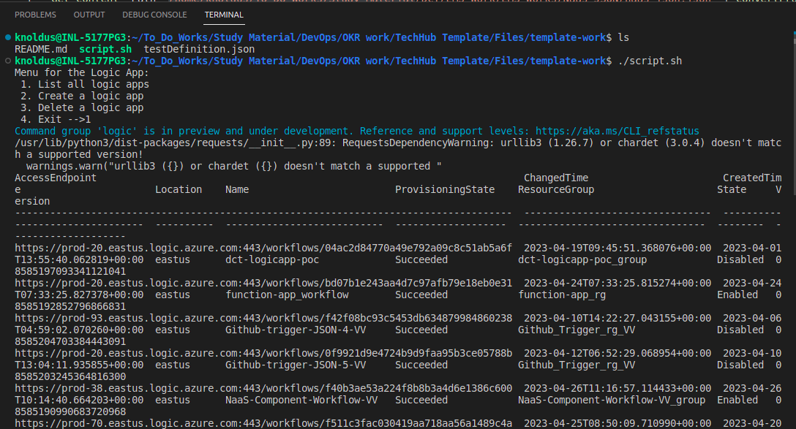
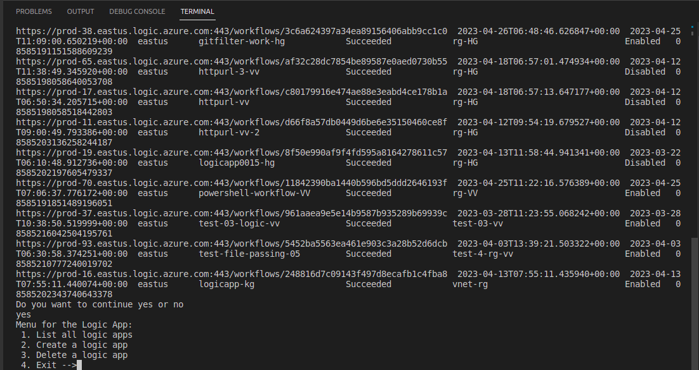
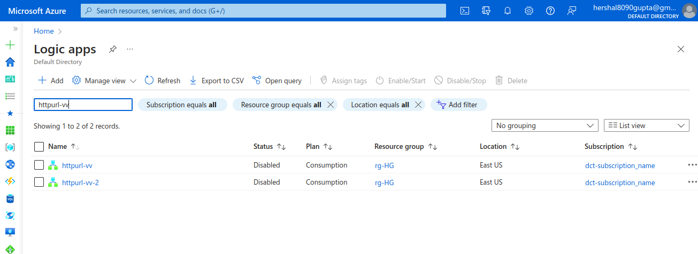
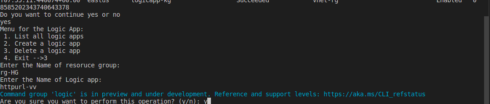
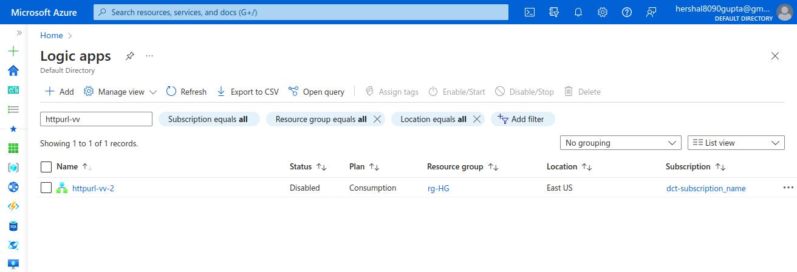
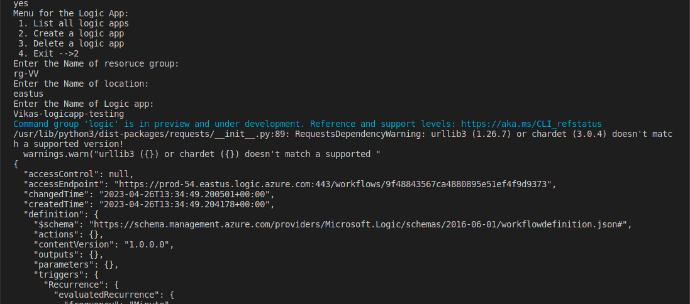
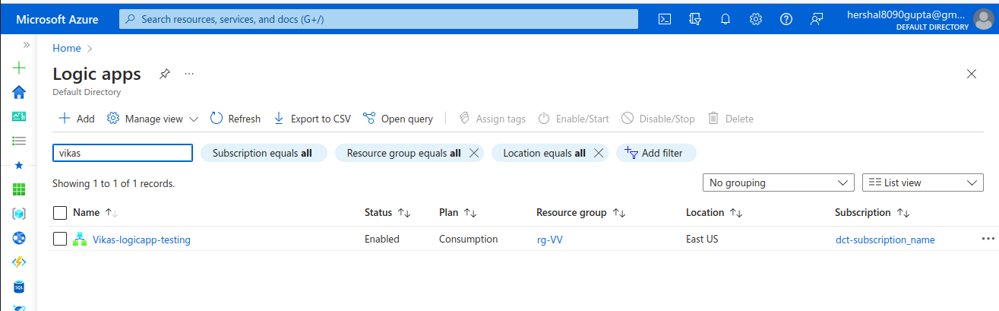

## Description

In this template we will list all the logic apps in the azure and then we can delete or create the Logic app with the workflow using AzureCli and running it through Powershell script.

---

### Steps

* Login into AZ account using `az login` or `az login --tenant <TENANT-ID>`
* Change the permission of the file `chmod a+x script.sh`
* Go to the terminal and run the command `./script.sh` or run the script from any ID like Visual Code or IntelliJ.

---

### Outputs

1. Here, In this step, we are listing all the logic apps present in the Azure account :

2. Here, In this step, we are deleting the particular logic app, Before deleting the Azure Logic app on UI :

3. Here, In this step, we are deleting the particular logic app, by passing the logic app name and resource group :

4. Here, In this step, we are deleting the particular logic app, After deleting the Azure Logic app on UI :

5. Here, In this step, we are creating the particular logic app by passing the name , resource group and location :

Creating the logic app workflow in this step using the `taskDefinition.json` file.

6. Here, In this step, we have created the particular logic app and verifying it from Azure cloud :

---